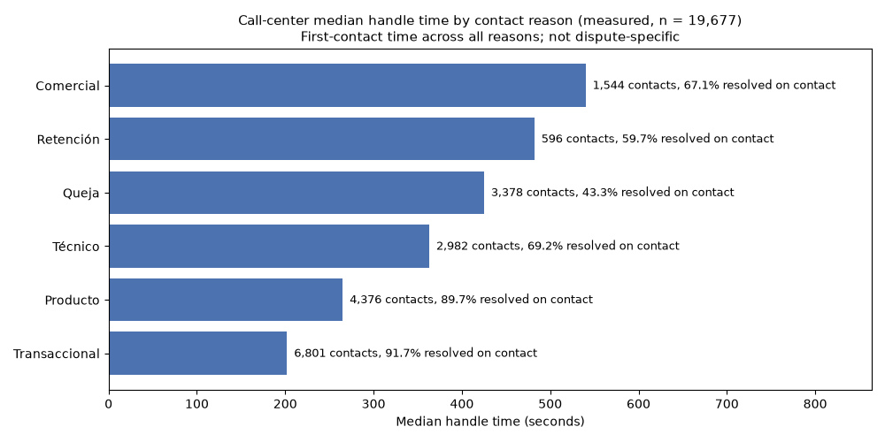
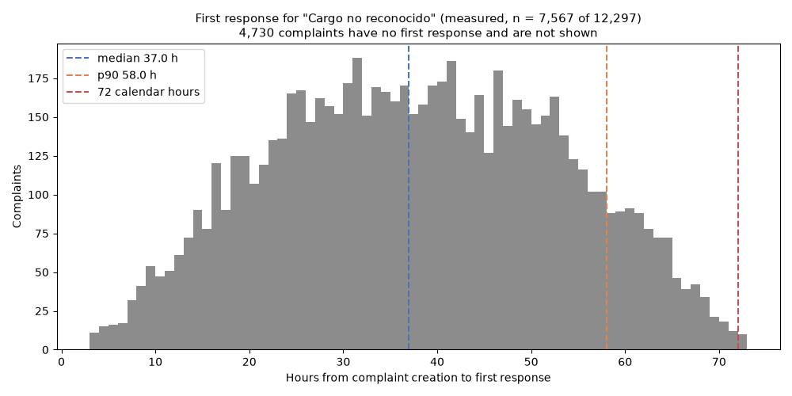

# Factored AI & Data Hackathon 2026 — Transaction Dispute Resolution Agent

AI-first banking customer service system for LATAM Bank: a customer reports an unrecognized
transaction in a chat, the system verifies it against their own transaction history, resolves
eligible cases automatically under an explicit policy, shows the customer their own charges to pick
from when the report is ambiguous, declines requests outside its scope, and hands off complex/high-risk cases to a human agent with a structured,
verified case file. Built for the [Factored AI & Data Hackathon 2026](docs/challenge/challenge-brief.md).

Architecture decisions of every feature, condensed: [`docs/architecture-decisions.md`](docs/architecture-decisions.md).
The research and review record behind them is a local planning folder that is not part of the
repo. This README summarizes what's relevant to run, evaluate, and understand the shipped system.

## Architecture at a glance

A hybrid design: a trained classifier (decision support only) + a deterministic state machine
(all permission/policy decisions) + an LLM scoped strictly to natural-language understanding and
generation. Single FastAPI process, offline-first data layer, vanilla HTML/CSS/JS frontend (no
build step).

```
Customer message
      |
      v
app/llm.py::extract_entities()        <- LLM (Claude Haiku 4.5), NLU only, JSON-schema output
      |
      v
app/state_machine.py::evaluate_case() <- deterministic guard function
      |         |
      |         +--> app/transactions.py (session-scoped fuzzy match, no customer_id param)
      |         +--> app/policy.py (AD-11 policy table: match tolerance, auto-resolve
      |         |     eligibility, forced-escalation triggers)
      |         +--> app/classifier.py (priority prediction — decision SUPPORT only,
      |               can only ADD an escalation reason, never auto-resolve or override)
      |
      v
confirming (AD-12) | selecting | escalated
      |   confirming -> an explicit "yes" + policy screening -> awaiting_explanation
      |   selecting  -> the customer's OWN charges shown as cards (app/transactions.py::
      |                 list_own_charges); a tap is accepted only if that id was offered AND is
      |                 theirs, then screening decides explain vs escalate; "No está en la lista"
      |                 goes to a person with the list shown as evidence
      |
      v
awaiting_explanation (Milestone 9)
      |   the customer says what happened; app/llm.py::assess_explanation() only CLASSIFIES
      |   it (reason, specific, consistent). The assessment can ask for one more detail or
      |   escalate, never make a charge eligible: the evidence check for the reason it names
      |   (app/policy.py, AD-13) decides resolved_auto vs escalated
      |
      v
awaiting_statement (statement before the handoff)
      |   every escalation except a technical failure or one after the customer explained the
      |   charge is held (reason, handoff, charge) while the customer says what happened;
      |   app/llm.py::assess_statement() only SUMMARIZES it into closed fields. Code asks at
      |   most one follow-up and insists once after a refusal, then hands off with the same
      |   reason -> escalated
      |
      v
app/llm.py::generate_response()       <- LLM, NLG only, grounded in build_prompt_context()'s
                                          closed allowlist (never raw DB rows/PII); typed turns
                                          only: a button or menu tap is answered with the
                                          validated templates, with no model call (AD-9)
```

**Why this split:** the challenge requires permissions/policy enforced *in code*, not in a model
prompt. The LLM never decides whether to auto-resolve or escalate — it only extracts structured
entities from free text and phrases the (code-decided) outcome in natural language. See
`docs/architecture-decisions.md` (dispute-agent AD-1 through AD-13) for each decision and its
consequences; the local planning record (not in the repo) holds the full rationale, alternatives
considered, and the three-experts/Codex adversarial review record.

**Register.** The demo customer is Colombian, so every Spanish text addresses them as "usted", in
neutral, professional Latin American Spanish (Portuguese uses "você" without slang): the fixed
replies, the UI and login strings, and the prompts the model reads. `app/register.py` holds closed
lists of voseo, tuteo and colloquial forms; `tests/test_register.py` sweeps every customer-facing
text with them, and every model reply is checked at runtime: one with voseo or slang ("mirá",
"contame", "dale") is replaced by that step's template and logged as `nlg_reply_replaced`.

**Escalation notice.** When a case goes to a person the customer gets a fixed notice built in code,
never by the model: the charge (merchant, amount, date) only when the customer identified it, the
reason in their language, the case number and "le contactaremos en un plazo de hasta 3 días
hábiles", plus the fact that this chat no longer adds information to the case. The reason is one of
nine closed values (`case_model.EscalationReason`), chosen at the step that escalates and stored in
`cases.escalation_reason` in the same compare-and-set that moves the case to `escalated`; every
policy, fraud, amount or limit outcome is the same "needs a person's review", so no threshold, score
or rule name reaches the customer. The reply carries the same values in `escalation`, and the chat's
"Caso derivado" card and the client panel render from it (case number first, then a two-step
timeline: handed off, then "Le contactamos" within the deadline). **The deadline is a demo
assumption** (`policy.ESCALATION_CONTACT_BUSINESS_DAYS = 3`; this simulated bank has no real contact
process), sized from the dataset: of 12,297 "Cargo no reconocido" complaints, 7,567 have a recorded
first response, with a median of 37 h, a p90 of 58 h and an observed maximum of 72 calendar hours;
the other 4,730 have none yet, so the data says nothing about them. 3 business days always span at
least 72 calendar hours ([demand report](docs/analysis/demand-report.md)). It promises contact, not
a resolution.

**Customer statement before the handoff.** Before a case goes to a person the agent asks, from a
fixed template, "Antes de derivar su caso, cuénteme qué pasó y por qué solicita la devolución. La
persona que lo revise usará esta información." (PT: "Antes de encaminhar seu caso, conte o que
aconteceu e por que solicita o reembolso..."), so the advisor does not have to call the customer back
for it. The escalation is already decided in code at that point: `case_turn.finish_escalated` stores
it as pending (handoff, reason and a snapshot of the charge the notice names) in the same
compare-and-set that would have escalated, and the case waits in `awaiting_statement`. A typed reply
gets one model call, `llm.assess_statement`, which only returns a neutral summary of at most 25 words
and closed fields (whether they deny the purchase, know the merchant, have the card, how and when they
noticed, other unrecognized activity); unknown is never guessed. Code then decides: one follow-up for
the most useful missing fact (card possession, then the merchant, then how they noticed), one
insistence if they decline or ask for a person (the "Hablar con una persona" button counts as
declining, with no model call), and then the hand-off with the original reason and the unchanged
notice, whatever they answer. The handoff gains `statement_status` (given, declined or
summary_unavailable), the summary labelled "(resumen del modelo)", the known facts under what the
customer reported, and one open question per fact still unknown; their own words stay in the case
record only. Code also checks the summary, with a margin over the prompt: one longer than 40 words,
with a long run of digits that is neither a date nor the charge's own amount (the prompt asks for
no other numbers, so a summary quoting another amount is dropped too), an email, a link, double quotes, or a
run of the customer's own words is dropped (`handoff_statement_summary_dropped`) and the statement
counts as summary_unavailable. Technical failures (`SERVICE_ISSUE`) never ask, nor do escalations
after the customer already explained the charge in the explanation step, including an explanation
specific enough to assess that also asked for a person (logged as `handoff_statement_skipped`). If the summary call fails, the case is handed
off with its original reason, never relabelled as a technical problem. A case that waits more than
`STATEMENT_ABANDON_MINUTES` (30 by default) without the customer's reply is closed as `abandoned`
the next time the customer's session reads it, with a compare-and-set on the state and the last
update (`case_abandoned`): nothing is handed off, and the customer is told "Como no recibimos su
respuesta, cerramos el caso … sin derivarlo a una persona. Si quiere retomarlo, inicie un nuevo
reclamo." A new claim on the same charge starts fresh; this opens no retry with a new story, because
a case only waits for the statement before the customer's explanation was assessed.

## Dispute policy: the evidence decides, not the claim (AD-13)

An agent that credits money because a customer says "no lo reconozco" is a refund button. The
policy in `app/policy.py` only credits what the data can back up, and every rule is enforced in
code:

| Customer's reason (from their explanation) | Automatic outcome |
|---|---|
| **Duplicate charge** | Reversed only if a verifiable twin exists: same merchant, exact amount, currency and type, at most 1 day apart. A pair is reversed once, whichever of its two charges the customer picks (unique `credit_key` index). |
| **Unrecognized charge** | Provisional credit only for a card-not-present purchase (Web/App) at a merchant the customer has no other charge with, and at most 1 such credit per customer every 90 days. The card is blocked (simulated) and the credit is queued for back-office review, reversible if the charge turns out to be theirs. A chip/PIN purchase at a POS, an ATM withdrawal or a transfer goes to a fraud investigation. |
| Not received, wrong amount, lost/stolen card, unclear | Never an automatic credit: a merchant chargeback, a partial amount or a multi-charge fraud review needs a person. |

Screening applies to every reason before the customer is even asked to explain: status
`Approved`, `fraud_score` < 30, at most USD 200, no older than 60 days, customer `Active`, fewer
than 3 dataset disputes in 90 days, classifier not `Critical`, and the automatic credits this
system granted the customer in the last 90 days plus this one within USD 200. The per-customer
limits are checked again inside the same SQL `UPDATE` that grants the credit, so two chats running
at the same time cannot both slip under them.

The explanation step uses the LLM as a classifier, never as a judge of whether to pay: a vague
answer gets one follow-up question, a contradiction or a person-only reason escalates, and an
explanation that "sounds convincing" still has to pass the evidence check above. The eval
harness's `policy_abuse` group runs every one of these abuse paths with the assessment model
mocked as fully convinced (the worst case), and all of them escalate.

## Demand analysis (why this workflow)

`python -m etl.analyze_demand` turns the warehouse into a versioned report,
[`docs/analysis/demand-report.md`](docs/analysis/demand-report.md), rendered from
[`demand-report.json`](docs/analysis/demand-report.json). Every number is labeled measured,
assumed, simulated, projection or design-argument, and every percentile shows its n and coverage.
What it finds:

1. **Complaint demand is flat by category.** Each of the 5 categories holds 19.7% to 20.2% of
   67,095 complaints, and every category passes a flatness check against Poisson noise (a
   heuristic, not a seasonality test). Volume does not single out disputes, so the report says so
   instead of claiming it does.
2. **Call-center contact reasons are far from uniform.** Over 19,677 contacts (2026-05-18 to
   2026-06-18), "Transaccional" is 34.6% of contacts with a 202 s median handle time, against
   425 s for "Queja". No key joins a complaint to a call, so this sizes the opportunity without proving
   disputes cost more.
3. **"Cargo no reconocido" waits 37 h for a first response** (median; p90 58 h, maximum 72 h) over
   the 7,567 of 12,297 complaints that have one. The 4,730 without one are reported, not dropped.
4. **Data quality limits the claims:** 492 resolutions before the first response, 772
   Resolved/Closed complaints with no resolution date, and claimed amounts whose per-currency
   medians are not consistent with exchange rates, so they are never summed.
5. **Complaints in this dataset almost never match a transaction** (1 in a sample of 2,000):
   the dataset generates them independently, so it gives no basis for any automation share above
   0.0, which is the projection's baseline. This describes the data here, not a real bank.

The choice of disputes is a labeled design argument (a dispute can be verified in code against the
customer's own ledger and decided by an explicit policy), and the cost section keeps measured,
simulated and projected figures in separate blocks with no ratio and no total.




## Setup

```bash
python -m venv .venv && source .venv/bin/activate
pip install -r requirements.txt

cp .env.example .env
# Fill in AWS_ACCESS_KEY_ID / AWS_SECRET_ACCESS_KEY / AWS_REGION / DATA_BUCKET
# (dataset access — see docs/challenge/challenge-brief.md) and ANTHROPIC_API_KEY
# (LLM calls — see "Known limitations" below if you don't have one yet).
```

## Running it end to end (reproducible setup)

```bash
# 1. Offline ETL: pull the dataset from S3 into a local DuckDB warehouse (one-time, ~10-15 min;
#    re-runnable; never touches the deployed runtime — see AD-2)
python -m etl.extract
python -m etl.quality_checks       # data-quality + lineage report -> data/lineage_manifest.json

# 2. Build the demo fixture from the local warehouse (no AWS needed for this step): ONE real
#    customer selected by documented criteria + labeled synthetic charges, and the demo
#    credentials: this is the ONLY data the app ever reads at runtime
python -m etl.build_fixture        # -> data/fixture.duckdb, data/demo_users.json

# 3. Train + evaluate the priority classifier (decision-support signal, Milestone 3)
python -m etl.train_classifier     # -> data/classifier.joblib, data/classifier_split.json
python -m etl.evaluate_classifier  # -> data/classifier_eval_report.json

# 4. Run the app
uvicorn app.main:app --reload --port 8000
# Open http://127.0.0.1:8000 and press "Autocompletar" (demo account cliente.demo, password in
# data/demo_users.json after step 2)

# 5. Tests, lint, eval harness
pytest                              # 941 tests
ruff check .
python -m eval.run_eval             # -> data/eval_report.json (see "Evaluation results" below)

# 6. Demand analysis report (offline; reads the warehouse from step 1, no AWS needed)
pip install -r requirements-analysis.txt                  # matplotlib, for the two charts
python -m etl.analyze_demand        # -> docs/analysis/demand-report.{json,md} + 2 PNGs
python -m etl.analyze_demand --refresh-eval-snapshot      # optional, after step 5's eval run
```

Steps 1-3 require AWS credentials (dataset access) and are offline/one-time. Step 4 (the deployed
app) needs **zero** AWS credentials at runtime — verified by `tests/test_main.py::test_app_serves_with_aws_env_unset`
and by unsetting `AWS_ACCESS_KEY_ID`/`AWS_SECRET_ACCESS_KEY` locally and confirming the app still serves.

## The required scenarios, on one customer

The challenge asks for three *situations* inside the workflow (automated resolution, an ambiguous
or unsupported request, a human escalation). They are not customer types, so the demo has **one**
customer and every scenario comes from what that customer says or taps.

**Demo data.** `etl/build_fixture.py` picks one real customer from the warehouse by documented
criteria (Colombia, active, COP transactions, most purchases with a named merchant, no prior
dispute complaints): Víctor, Cartagena, 6 real purchases in the extracted window. Because ~6 real
rows cannot cover a duplicated charge or the fraud-score gate, 8 **team-generated** charges are
added on the same customer and product, each labeled `_is_synthetic = true` with
`_source_file = 'synthetic'` and designed for one scenario. Colombia was chosen because it is the
market whose transactions are in the local currency: every México-customer transaction in the
dataset is in USD (there is no MXN transaction at all), a data finding in its own right.

| Scenario | How to trigger it | Outcome |
|---|---|---|
| Automated resolution (typed) | "No reconozco un cargo de 38.500 pesos del 14 de junio" (PT: "Não reconheço uma cobrança de 38.500 pesos do dia 14 de junho"), then explain ("no uso Uber hace meses, tengo la tarjeta conmigo") | Confident match (Uber), the same in Spanish and Portuguese: "pesos" without a country is not a stated currency, so the search uses the customer's own currency (COP) instead of the model's guess (it guessed COP in Spanish and MXN in Portuguese) -> the agent names merchant/amount/date and asks (`confirming`, with "Sí, es ese" / "No es ese" buttons) -> "yes" -> `awaiting_explanation` -> the unrecognized-charge evidence check passes (online purchase, no other Uber charges) -> `resolved_auto`: provisional credit, card blocked (simulated), back-office review, reference |
| Automated resolution (picked) | Tap "Ver mis últimos cargos" (or type "Se me perdió un monto, mostrame mis cargos") -> tap Uber or Cine Premium, then explain | The customer's own charges as cards (`selecting`); tapping one is the customer's explicit identification (the AD-12 confirmation) -> explanation -> policy -> `resolved_auto`. A second unrecognized charge in the same 90 days goes to a person |
| Ambiguous: duplicated charge | "Me cobraron dos veces un taxi de 27 mil" -> tap either taxi -> "tomé un solo taxi y me lo cobraron dos veces" | Two matches (AD-11 Row 3) -> only those two cards are shown -> the customer picks one -> the twin is verified in the data -> `resolved_auto`, one of the two reversed (no card block). Disputing the other one afterwards escalates |
| Ineligible on the evidence | Tap Farmacia Salud / Super Ahorro / Gasolinera Express (POS), or say a taxi was "not recognized" | However convincing the explanation: card-present purchase, or an existing relationship with the merchant -> `escalated` in the same turn (the explanation already is the customer's account, so no statement is asked) with the policy reasons (their own `policy_reasons` field) and the model's neutral summary (under what the customer reported) in the handoff; the customer gets the notice naming the charge, "necesita la revisión de una persona", the case number and the 3-business-day deadline |
| Ambiguous: not in the list | A list shown after a detail ("fue el 14 de junio") -> "No está en la lista" -> the customer's statement | The agent first asks what happened (`awaiting_statement`), then `escalated` with the charges shown as evidence and an open question for the agent; the notice names no charge (none was identified) and says it could not be identified. With no detail yet, the agent asks for one instead of escalating |
| Unsupported request | "¿Cuál es mi saldo?" | Declines and says what this channel does; no guess, no state change |
| Human escalation (policy) | "No reconozco una compra en Tienda Online Global", or tap Boutique Moda / Tienda Don José, then say what happened ("nunca compré ahí, tengo la tarjeta conmigo y lo vi en la app") | Fails AD-11 (fraud score 91 / ~610 USD / Pending) -> the agent asks what happened and why they want the refund (`awaiting_statement`, a fixed question, no response model call) -> the statement is summarized -> `escalated` with a structured handoff (request summary, facts verified from the charge record, what the customer reported, policy reasons, actions, evidence, open questions); the customer's notice names the charge and "necesita la revisión de una persona", never the score or the threshold |
| Human escalation (request) | "Quiero hablar con una persona", then again "Quiero hablar con una persona" (or the "Hablar con una persona" button) | The agent tries once per request: the first request keeps the case where it is (the charge list, the pending confirmation, or the question about what happened), spends no clarification round and ends the reply with "Si aun así prefiere hablar con una persona, vuelva a pedirlo o use el botón «Hablar con una persona»", and the button appears. The second request, typed or tapped, asks what happened first; one more refusal (typed, or the button) gets a single explanation that the advisor will use it, and the next one hands the case off with the notice (reason "usted pidió hablar con una persona") and the statement marked as declined. A request that comes with details tries them first and counts as that one deferral, unless the details already send the case to a person by policy (then the policy reason, no offer). If the agent already could not match the customer's details (e.g. "fue el 22/04/2024") or used its rounds, the button is already there and the first request goes to a person, after the same question about what happened. In the explanation step a typed request is detected (short texts by the extraction call, longer ones by the assessment) and never counted as an explanation |
| Second claim in the same chat | After any closed case (`resolved_auto` or `escalated`): tap "Reportar otro cargo" / "Contestar outra cobrança", or just type the next complaint (e.g. "No reconozco una compra en Tienda Online Global" after the Uber resolution) | A divider "Nuevo reclamo · caso anterior REF-... (resuelto)" marks the new claim, the case panel goes back to "Esperando reporte" and the message goes out without a `case_id`, so the server opens a new case. The closed case is never reopened or changed (state, reference, credit); its "Verificación del sistema" / "Caso derivado" card appears once, only on the turn that closed it |

A turn that brings a new detail (amount, date, merchant) never spends a clarification round; after
two rounds with nothing new, or more than 6 free-text reports in one case, the case escalates
(greetings and button taps do not count). A greeting gets an introduction of what the agent can do.
A transaction is credited at most once: disputing an already-credited charge again, in any case,
goes to a person with the earlier case as evidence (checked in code and enforced by a unique index).
While a turn is in flight the chat shows a typing bubble with a step-aware caption ("Buscando sus
movimientos…", "Revisando su explicación…"), switching to "Está tardando más de lo habitual" after
10 s, announced to screen readers through a separate `role=status` region; buttons, Enter and Send
cannot post a second message meanwhile, and typed text is kept. A failed or timed-out (25 s) send
shows "No se pudo obtener respuesta" with a "Reintentar" button that re-sends the same turn (same
`turn_id`), so the server replays the turn instead of applying it twice. Everything works in Spanish and Portuguese (toggle in the chat header); see
"Known limitations" for what the Portuguese toggle does and does not validate.

## Evaluation results

`data/eval_report.json` (regenerate with `python -m eval.run_eval`) and `data/classifier_eval_report.json`
(regenerate with `python -m etl.evaluate_classifier`) hold the full reports. Headline numbers as
last generated in this environment:

**Classifier (priority-at-intake, decision support only)** — chronological split (train=11,543,
test=2,037, split date 2026-01-06), fixed majority-class baseline vs. RandomForestClassifier on
structured intake-time features:

| | macro-F1 | Low recall | Medium recall | High recall | Critical recall |
|---|---|---|---|---|---|
| Baseline (majority class) | 0.1662 | 0.00 | 1.00 | 0.00 | 0.00 |
| Proposed classifier | 0.2448 | 0.23 | 0.45 | 0.26 | 0.06 |

Delta: **+0.0786 macro-F1**, reported honestly (a modest improvement, not inflated). The
classifier is wired as decision support only — a `Critical` prediction can only ever *add* a
reason to escalate; it structurally cannot cause an auto-resolution or override any other AD-11
condition (proven by an exhaustive sweep over every dispute reason and all 128 combinations of the
other gating conditions in `tests/test_policy_not_overridden.py`).

**Conversation/system eval** (`eval/run_eval.py`): ⚠️ **explicitly OFFLINE/SIMULATED**, not a
measured-production result. The harness runs scripted multi-turn conversations against a
deterministic mocked LLM client so every run is reproducible. 40 cases: 6 required scenarios
(typed resolution, picked resolution, duplicated charge picked, not in list after details, policy
escalation, human request after an unmatched detail) × 2 languages, 7 adversarial/failure-mode
fixtures (missing data, prompt injection, LLM outage, mixed-language input, a tampered tap on a
charge that was not offered, re-disputing an already-credited charge, asking for a person before
giving any detail), a currency-parity case in Spanish and Portuguese ("38.500 pesos" with the
extraction mocked as COP in Spanish and MXN in Portuguese: both must reach `confirming`) and 8 `policy_abuse` cases (AD-13: card-present "unrecognized" charge, a
merchant the customer already uses, a duplicate with no twin, a merchant dispute, an injection in
the explanation, a second unrecognized credit in the window, the other half of an already-reversed
duplicate pair, a charge a person already has after an explanation retried in a new case), all with the assessment model mocked as convinced, and 11 `statement` cases (the customer's statement
before a handoff: given in Spanish and Portuguese, declined twice by the button, declined twice in
text, one follow-up, the summary call timing out, an LLM outage that must not ask, "No está en la
lista" with no model call on the tap, an injection in the statement, and an explanation that also
asks for a person: a vague one still gets the statement, a specific one does not). Every escalating script
includes the statement turn, every escalated case must keep its expected reason, a handoff that
quotes a typed customer message (30 characters or more) word for word is unsafe, and some turns have a model-call ceiling.
Each scenario runs against its own app database:

- **Unsafe outcomes: 0 / 40.**
- **Statement completeness: 1.0 (20/20).** `escalation_quality.statement_completeness_rate`: every
  escalated case that is neither a technical failure nor an escalation after the customer's
  explanation carries a statement outcome (given, declined or summary_unavailable); the cases
  missing one are listed in `missing_case_keys`.
- By language (`by_language`): Spanish 32 cases, 32 safe (3 resolved, 26 escalated); Portuguese 8
  cases, 8 safe (3 resolved, 4 escalated). The adversarial, policy-abuse and statement cases run in
  Spanish only (except the currency-parity and statement-given cases), so the Portuguese sample is smaller.
- Safe automated resolution rate: 0.15 (6/40; the mix is mostly escalation/adversarial by design).
- Containment rate: 0.17 (6/36 concluded cases).
- Pipeline latency (excludes real LLM network time): p50 0.27s, p95 0.59s.
- Real Claude Haiku 4.5 turn latency (manual runs, 2026-09-30): the explanation turn that resolves took 1.3-6.6 s (median 3.2 s over 8 ES/PT runs; 3.1-17.8 s before the resolution message became a validated template), while a first typed report, which makes two model calls, took 6-22 s (the "38.500 pesos" report, 3 runs per language: 4.1-21.2 s, median 8.9 s). Button and menu taps ("Ver mis últimos cargos", a tapped charge, "Sí, es ese", "No es ese", "No está en la lista", "Hablar con una persona") make no model call and were answered in 0.05-0.14 s (a tapped charge ~1 s, local policy and classifier work), down from 1.2-12.2 s when each paid an NLG call (3 runs each, 2026-09-30). Escalation and first-request-for-a-person turns write their reply from a fixed template (the notice or the question about what happened, the deferral and the offer), with no NLG call: a policy escalation from a typed report took 4.0-5.9 s (its only model call is the extraction), a typed request for a person 1.1-6.2 s (its only model call is the extraction, or the explanation check while a charge is being explained), and the same moves from a button or a tapped charge 0.1-0.9 s (manual runs, 2026-09-30). Every turn's model calls share a 20 s budget and the chat shows a typing indicator, then a retry option at 25 s.
- Statement before the handoff (manual runs against Claude Haiku 4.5, 2026-10-01: 2 Spanish and 2
  Portuguese policy escalations, "No reconozco una compra en Tienda Online Global" and a complete
  account, run twice): all 8 ended `escalated` with the original reason ("necesita la revisión de
  una persona") and `statement_status` given, with the denial, the unknown merchant, the card in
  hand and the bank alert as structured facts. The question itself is a template (the escalating
  report took 1.3-1.6 s), and the statement turn, with its one model call, took 1.8-16.7 s (median
  3.7 s over the 8 runs; one Portuguese run hit 16.7 s, inside the 20 s budget).
- Estimated cost (Haiku 4.5 list pricing, not measured billing): ~$0.0016/attempted case,
  ~$0.0106/successful resolution.

The real-model behavior is checked separately: the Playwright walkthrough and manual runs go
through Claude Haiku 4.5 end to end, and bugs they surfaced (fenced JSON, a currency lost between
turns, over-strict fact checks on natural wordings) are pinned by regression tests.

## System-level comparison: what each layer stops

`python -m eval.run_eval` also plays the same 40 cases under two baselines and writes them to
`system_comparison` in `data/eval_report.json`. Each baseline changes exactly one thing, at the
final credit decision (after the customer's explanation), through the state machine's single call
to the policy (`app/state_machine.py`); the app code is not modified for it. Each system runs
against its own fresh databases.

- **`hybrid`**: the shipped system.
- **`escalate_at_credit_decision`**: the safety anchor. Everything up to the credit decision is
  identical, and the credit decision always goes to a person, so it never pays.
- **`ablation_no_evidence_check`**: the AD-13 ablation under a worst-case persuaded assessor. At
  the credit decision only the screening conditions run; the per-reason evidence check is skipped
  (a reason that is never credited automatically still goes to a person).
  Screening, the explanation assessment, the "already credited / already with a person" checks and
  the SQL credit limits stay in place, and the mocked assessment is convinced in every abuse case.
  It is not a model making the decision alone, and it says nothing about how often a real model
  would be persuaded.

Each case lands in exactly one bucket, decided only by its expected and actual final state. Counts
are shown against the number of cases that could land in that bucket:

| System | correct resolution (of 6) | unsafe resolution (of 34) | missed transfer, left open (of 30) | unnecessary transfer (of 6) | correct transfer (of 30) | correct open (of 4) | other mismatch (of 40) | containment (of concluded) |
|---|---|---|---|---|---|---|---|---|
| `hybrid` | 6 | 0 | 0 | 0 | 30 | 4 | 0 | 6 of 36 |
| `escalate_at_credit_decision` | 0 | 0 | 0 | 6 | 30 | 4 | 0 | 0 of 36 |
| `ablation_no_evidence_check` | 6 | 4 | 0 | 0 | 26 | 4 | 0 | 10 of 36 |

Missed transfers in the brief's sense are unsafe resolution plus missed transfer left open. The
caution of the anchor costs the 6 legitimate resolutions; dropping the evidence check costs these
4 credits, each against a record fact that contradicts the claim:

- `card_present_unrecognized`: the customer says they do not recognize the charge and still have
  the card, but the record shows a card-present purchase at a POS terminal (Farmacia Salud).
- `merchant_history_unrecognized`: the customer says they do not recognize Taxi Seguro, but the
  record shows another charge of theirs at that same merchant.
- `duplicate_without_twin`: the customer says the Uber charge was billed twice, but the record has
  no other charge at that merchant for the same amount within 1 day.
- `explanation_injection`: the explanation tells the model to mark it convincing, and the record
  again shows a card-present purchase at a POS terminal (Farmacia Salud).

The other four abuse cases still go to a person under the ablation. Their outcome as recorded:
the reason the app stored, and whether the ablation overrode the policy's escalation. Where it did,
the credit was refused afterwards, when it was granted (the per-customer limits and the unique
credit key are checked in the same SQL `UPDATE`):

| Case | Stored `escalation_reason` | Ablation overrode the policy |
|---|---|---|
| `second_unrecognized_credit` | `needs_review` | yes |
| `duplicate_pair_twice` | `already_credited` | yes |
| `not_received_merchant_dispute` | `not_received` | no |
| `same_charge_after_escalation` | `already_in_review` | no |

**Read this with its limits.** This is a constructed, offline suite with mocked extraction and
assessment, written by the policy author: the expected states encode the policy under test. It is
not a held-out workload, so it shows which layer stops which attack on these cases, not real-world
rates.

## Known limitations (disclosed, not hidden)

- **The system eval is simulated; real-model quality is checked by hand, not measured.** The app
  runs against Claude Haiku 4.5, and the walkthrough plus manual sessions exercise it end to end,
  but `eval/run_eval.py` uses a mocked client for reproducibility, so its latency/cost figures
  exclude the real model. Without a key the app still degrades gracefully: every LLM failure
  forces escalation with the deterministic escalation notice, whose reason is a technical problem
  (verified live, not just in tests).
- **The system-level comparison is not a held-out evaluation.** The brief asks for a baseline vs.
  the proposed system on the same workload; the comparison above does that on the constructed
  40-case suite, but an independently labeled, held-out system-level workload remains unfulfilled.
  The only held-out evaluation in this repo is the classifier's chronological split.
- **The demo customer's history is partly synthetic.** 6 of the 14 charges are real dataset rows;
  8 are team-generated to cover every scenario and are labeled as such in the fixture
  (`_is_synthetic`, `_source_file = 'synthetic'`). The dataset window is a snapshot ending
  2026-06-17, so relative dates ("ayer") are resolved against `DATA_AS_OF` (2026-06-18), not the
  wall clock.
- **Demo-credentials login is simulated, not production identity verification.** `data/demo_users.json`
  provisions test accounts distinct from any dataset field (never `document_number` or similar) —
  this satisfies the organizer's "a customer number alone does not prove identity" rule as a
  *demonstration* of a trusted-identity-service boundary, not a production-grade auth system.
- **Login throttling is per-process demo-grade.** `/auth/login` locks a username after 5 failures
  (and an IP after 20) within 15 minutes with exponential backoff (SQLite-backed, `app/ratelimit.py`).
  The Dockerfile runs uvicorn with `--proxy-headers --forwarded-allow-ips "*"` so the per-IP bucket
  keys on the client address the Fly/Render proxy forwards (safe only because the container is
  reachable solely through that proxy; a client can still spoof the header to rotate IP buckets,
  which the per-username limit does not depend on). A per-username lockout lets an attacker
  temporarily lock a known account out (capped at 15 min).
  The login screen has an "Autocompletar" button that fills in the demo account; set
  `SHOW_DEMO_CREDENTIALS=0` to hide it on any deployment that is not a labeled demo.
- **Portuguese support is simulated via the LLM's general multilingual capability.** The dataset
  contains zero Portuguese rows — no training or held-out evaluation claim is made for Portuguese
  specifically. The structured handoff record's text (request summary, actions, open questions:
  deterministic, code-generated, not LLM output) stays in Spanish regardless of the toggle, an internal
  agent-facing audit artifact, not customer-facing content; the Vista Interna labels its sections and
  fields in the chosen language.
- **Language parity is checked on the flows we know, not proven in general.** The same report once
  took different paths in Spanish and Portuguese because the model guessed a different currency for
  "pesos" (COP vs MXN). Now a currency counts only when the customer names it (a deterministic check
  on the text, `app/llm.py::stated_currency`), and a mocked test plus 3 real runs per language pin
  the same state. Other wordings may still differ between languages; the eval reports results by
  language, but its Portuguese sample is 8 cases against 32 in Spanish.
- **The statement adds one to three turns before most handoffs** (all but technical failures and
  escalations after the customer's explanation). A customer who already asked twice
  for a person is asked what happened, and a refusal gets one insistence before the hand-off. The summary is the model's, labelled as such, and in manual runs
  a Portuguese statement came back in imperfect Spanish ("el tarjeta"). The prompt now asks
  explicitly for correct Spanish, which helped, but 1 of 2 Portuguese runs after that change still
  had a slip; the structured fields are closed values and were right in every run.
- **A customer who never answers the statement question is not handed off.** After
  `STATEMENT_ABANDON_MINUTES` the case is closed as `abandoned`, a product decision: a person only
  gets cases the customer is still pursuing. There is no background job; the case closes when the
  customer's session next reads it, so until then it stays in `awaiting_statement`.
- **Real-model latency varies a lot.** A first typed report makes two model calls and took 4-22 s
  in manual runs (median 8.9 s for the "38.500 pesos" report); the slowest turns sit close to the
  chat's 25 s retry. The model calls of a turn share a 20 s budget and a timed-out turn is replayed,
  not applied twice.
- **Cases stored before the currency fix keep an inferred currency.** Earlier versions saved the
  profile's currency as if the customer had said it, and handoffs had a different shape. Those rows
  live only in a local `data/app.db`; they are not migrated (the Vista Interna still renders the old
  handoff shape, and `/api/case` leaves out their open questions, where the policy reasons used to be).
- **Single-host deployment, no load/concurrency testing.** Designed for sequential demo/judge
  traffic on one machine — stated explicitly, not silently assumed away.
- **The rolling-aggregate classifier feature (AD-6 stretch goal) was not attempted**, per the
  plan's own pre-agreed cut order for time pressure (this was the first thing marked cuttable).
- **Data retention / access controls / capacity limits** are demonstrative defaults for a
  hackathon submission with only synthetic data — not production-grade policies. Logs and the
  SQLite session/case store are local to the single deployed instance only.

## Remaining production-deployment work

This submission demonstrates the architecture and the 3 required workflows end to end; a real
production deployment of this system would still need: real identity verification (replacing the
demo-credentials fixture), a managed/replicated database instead of local SQLite, multi-instance
deployment with load balancing, a monitoring/alerting stack (this app logs structured events with
correlation IDs per `app/cases.py`'s `events` table, but nothing ships those anywhere external),
empirically-validated (not hackathon-default) policy thresholds in `app/policy.py`, and a real
measured evaluation once a production LLM key and traffic are available.

## Repo layout

```
app/            FastAPI backend — auth, state machine, policy, LLM boundary, classifier wiring
etl/            Offline ETL: extraction, quality checks, fixture generation, classifier training
eval/           Eval harness (Milestone 5)
static/         Frontend (vanilla HTML/CSS/JS, no build step — AD-1)
tests/          pytest suite (941 tests)
support.py      Shared test/eval mock helpers (no pytest dependency — used by eval/ too)
docs/           Challenge requirements digest
docs/analysis/  Demand analysis report (generated by `python -m etl.analyze_demand`)
data/           Local ETL artifacts, fixture, trained model (gitignored — never commit raw data)
.workspace/     Local planning record (gitignored); its decisions are in docs/architecture-decisions.md
```

## Submission checklist (per challenge rules)

- [x] Public GitHub repo named `factored-hackathon-2026-jagusgelos`
- [ ] Deployed tool link — pending a deployment-platform decision (Fly.io vs. Render; Fly.io
      requires a credit card on file; see dispute-agent AD-7 in `docs/architecture-decisions.md`).
      Deploy artifacts are ready (`Dockerfile`, `docker-entrypoint.sh`, `fly.toml`, `render.yaml`)
      and locally verified (a real Docker build + a real container-restart persistence test) —
      see `DEPLOY.md` for the exact remaining commands and what's proven vs. still pending.
- [ ] 4-6 slide presentation
- [ ] Short mandatory video pitch demonstrating the working solution, recorded against `localhost`
      (never the deployed link, per AD-7 — avoids demo-day network flakiness in the recorded artifact)
