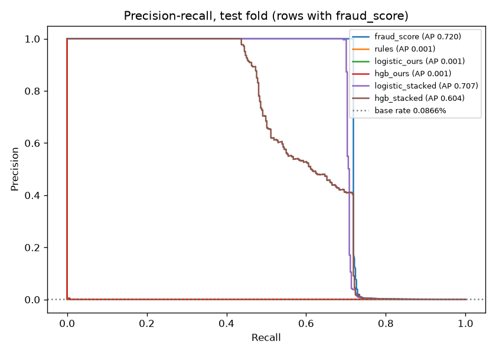
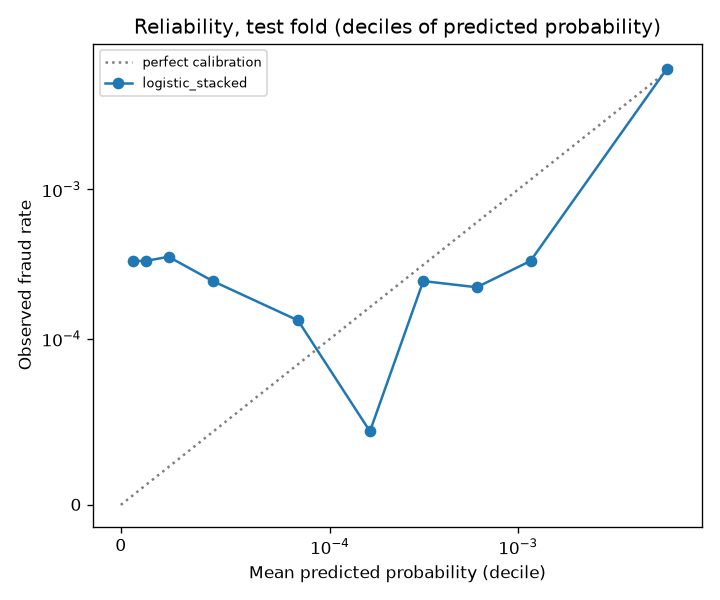

# Fraud-risk model card: our model vs the bank's fraud_score

**Short version.** We built a per-charge fraud-risk model from customer behavior (new merchant,
new city, distance and speed from the last geolocated charge, amount z-score, transaction
bursts, hour, channel, type) and measured it against the bank's own `fraud_score` on a
chronological test fold of 451,556 scored charges (391 frauds). **It does not beat
`fraud_score`.** Our behavioral features carry no measurable signal in this dataset (test PR-AUC
0.0009, the base rate), and adding them to `fraud_score` makes ranking slightly worse, not
better. The useful deliverable is therefore the **cost-justified operating threshold on
`fraud_score`**: escalate when `fraud_score > 30`, which keeps every fraud the current
`>= 30` rule catches and sends 18 fewer legitimate charges to a person on the test fold.

Labels used below: **MEASURED** (computed on the dataset), **ASSUMED** (an input we chose),
**DESIGN ARGUMENT** (reasoning, not a measurement). Every number comes from
`data/fraud_eval_report.json` produced by `python -m etl.evaluate_fraud_model`, unless stated.

## Data

| Item | Value | Label |
|---|---|---|
| Source | `transactions`, Hive partitions 2024-06-17 to 2026-06-17 (731 partitions) | MEASURED |
| Rows | 2,951,642, 0 duplicate `transaction_id` | MEASURED |
| Frauds (`is_fraud`) | 2,809 (0.095%) | MEASURED |
| Fraud rate per month | 0.076% to 0.118%, no trend (`data_profile.label_rate_by_month`) | MEASURED |
| `fraud_score` missing | 20.0% of rows, at the same rate for frauds and legitimate charges | MEASURED |
| `amount_usd` missing | 57.4% (every USD row; recomputed from the fixed 4000 COP / 350 ARS rates) | MEASURED |
| Coordinates present | 19.4% (card-present channels only) | MEASURED |
| Merchant name present | 23.3% | MEASURED |

Extraction: `python -m etl.extract --tables transactions --start-date 2024-06-17 --warehouse
data/fraud_warehouse.duckdb --manifest data/fraud_extraction_manifest.json` (about 9 minutes).
The existing `etl.quality_checks` ran on it: duplicate rate 0.0 (in band); mean null rate 0.199
(out of the 0 to 15% band), explained by the channel-specific columns above (coordinates,
merchant, `amount_usd` for USD), the same known pattern `etl/quality_checks.py` documents. Two years were chosen
so the test fold lands well above 300 frauds: it has 494 (391 with a score). The 30-day window
the app uses has only 92 scored frauds.

**The shape of `fraud_score` (MEASURED, all 2 years).** No legitimate charge scores above 30.0
(max exactly 30.0; 398 legitimate charges sit at exactly 30.0). 1,548 of the 2,240 scored frauds
(69%) score above 30; the other 31% are spread over 0 to 30 like legitimate traffic. So the score
is a near-perfect detector above 30 and uninformative below it. This is almost certainly a
property of the synthetic generator, not of a real vendor score (see Limitations).

## Labels and leakage audit

Target: `is_fraud`. The full column-by-column table lives in the docstring of
`etl/fraud_features.py`; the decisions in short:

| Column | Decision | Why |
|---|---|---|
| amount, currency, type, channel, merchant category, country/city, coordinates, timestamp | used | part of the authorization request |
| `customers.country`, `customers.registration_date` | used | set at onboarding, immutable |
| `fraud_score` | baseline; "stacked" variant only | it is what we measure against |
| `transaction_status` | excluded | outcome of the authorization or a later event (Reversed); fraud rate is flat across statuses (0.074% to 0.096%), MEASURED |
| `response_code` | excluded | produced by the same authorization decision the model would inform |
| `process_date` | excluded | posting date, after authorization |
| `customers.segment`, `credit_score`, `customer_status`, income | excluded | snapshots at extraction time, not at the charge; `customer_status` can flip because of the fraud |
| ids, branch_id, lineage columns | excluded | identifiers |

Customer-history features read only the same customer's transactions with an **earlier**
timestamp; two charges at the same second never see each other.
`tests/test_fraud_features_leakage.py` checks every history feature against a brute-force loop,
covers tied timestamps and interleaved customers, and asserts that appending future rows leaves
past features unchanged.

## Split and protocol (pre-registered in `etl/train_fraud_model.py`)

| Fold | Dates | Rows | Frauds |
|---|---|---|---|
| warm-up (history only, never a training row) | 2024-06-17 to 2024-08-15 | | |
| train | 2024-08-16 to 2025-08-31 | 1,528,441 | 1,527 |
| validation | 2025-09-01 to 2026-01-31 | 612,950 | 559 |
| test | 2026-02-01 to 2026-06-17 | 564,540 | 494 |

- Comparison population: rows with a `fraud_score` (the only rows where the baseline exists).
- Selection on validation PR-AUC only; the test fold was scored after every choice was fixed.
  During review the threshold search was made exact (it had sampled 400 candidates) and the
  confidence intervals were switched to a customer-cluster bootstrap; both changes were made
  without looking at test metrics, the threshold is still chosen on validation only, and every
  evaluation run is in `docs/ml/experiments.jsonl` (the numbers here are from the last one).
- Training uses every fraud plus a fixed 10% sample of legitimate rows, weighted x10 (an unbiased
  estimate of the full loss; validation and test are always scored in full).
- Calibration: Platt scaling fitted on validation for the selected configuration of each model family and variant (4 models).

## Baselines and candidates

- (a) `fraud_score` alone. (b) a red-flag count (new merchant, new country, foreign country,
  amount z-score > 2, speed > 500 km/h, another charge in the last hour).
- Logistic regression and `HistGradientBoostingClassifier`, each on our features ("ours") and on
  our features + `fraud_score` ("stacked"). Grids: LR C in {0.01, 0.1, 1} x class_weight in
  {None, balanced}; HGB learning rate in {0.05, 0.1} x leaves in {15, 31} x class_weight in
  {None, balanced}. 28 fits, every one logged in `docs/ml/experiments.jsonl` (next to the two
  baselines and the test evaluation).

## Results on the test fold (MEASURED, 451,556 scored charges, 391 frauds, base rate 0.087%)

95% CIs from 500 paired customer-cluster bootstrap replicates (customers resampled with
replacement with all their charges, since one customer's charges share history features); the
last column is the paired CI of PR-AUC(model) minus PR-AUC(`fraud_score`).

| Score | PR-AUC [95% CI] | ROC-AUC [95% CI] | Recall at FPR 0.1% | Recall at FPR 1% | PR-AUC minus fraud_score |
|---|---|---|---|---|---|
| **fraud_score** | **0.720 [0.676, 0.760]** | 0.847 [0.817, 0.875] | 0.719 [0.675, 0.759] | 0.726 [0.684, 0.766] | reference |
| rules | 0.0009 [0.0008, 0.0010] | 0.510 [0.491, 0.532] | 0.000 [0.000, 0.000] | 0.005 [0.000, 0.013] | [-0.759, -0.675] |
| logistic, ours | 0.0008 [0.0007, 0.0009] | 0.502 [0.474, 0.526] | 0.000 [0.000, 0.000] | 0.010 [0.001, 0.020] | [-0.759, -0.675] |
| HGB, ours | 0.0009 [0.0008, 0.0012] | 0.527 [0.498, 0.554] | 0.005 [0.000, 0.013] | 0.008 [0.000, 0.016] | [-0.759, -0.675] |
| logistic, stacked (selected on validation) | 0.707 [0.662, 0.750] | 0.847 [0.817, 0.875] | 0.708 [0.663, 0.751] | 0.714 [0.669, 0.756] | [-0.024, -0.005] |
| HGB, stacked | 0.604 [0.556, 0.647] | 0.861 [0.835, 0.886] | 0.719 [0.673, 0.759] | 0.721 [0.679, 0.761] | [-0.142, -0.097] |



Reading it:

- **Our features alone are at chance.** Every "ours" PR-AUC CI sits on the base rate and every
  ROC-AUC CI covers 0.5. On validation the same: 0.0009 to 0.0012 PR-AUC. The behavioral
  signals real fraud teams use (new merchant, impossible travel, bursts, amount spikes) are not
  generated into `is_fraud` in this synthetic dataset.
- **Stacking does not help.** The selected stacked model is slightly but significantly worse in
  PR-AUC than `fraud_score` alone (paired CI entirely below 0). HGB stacked gains ROC-AUC by
  reordering the uninformative 0 to 30 band and loses PR-AUC at the top.
- **Rows without a score (112,984 test rows, 103 frauds).** Our model is the only possible score
  there, and it is at chance too (ROC-AUC 0.55 and 0.49). It cannot replace a missing vendor score.

### Calibration

Brier score of the calibrated stacked logistic model: 0.000432, against 0.000865 for predicting
the base rate everywhere (MEASURED). By decile of predicted probability, the top decile is well
calibrated (predicted 0.62%, observed 0.64%, 290 of the 391 frauds), but the lower nine deciles
predict 0.001% to 0.12% where the observed rate is a flat 0.004% to 0.035%: inside the 0 to 30
band the model's ordering is noise, so its small probabilities there are not meaningful.



## Operating threshold by cost

The policy gate (`AUTO_RESOLVE_MAX_FRAUD_SCORE = 30` in `app/policy.py`, a hackathon default)
turned into numbers. Population: a **transaction-level proxy** for the charges the gate decides
on (score present, `Approved`, `amount_usd <= 200`): 91,666 validation charges (86 frauds), 84,269
test charges (71 frauds). The other AD-13 gates (charge age, customer status, dispute history,
classifier, the reason-specific evidence check) only exist once a customer disputes a charge, and
no historical complaint links to a transaction (`docs/analysis/demand-report.md`), so they cannot
be reconstructed here. Fraud prevalence among disputed charges is likely higher than in this
proxy, which would push the optimum toward escalating more, never less (DESIGN ARGUMENT).

| Cost input | Value | Label |
|---|---|---|
| Escalation (a person reviews the case) | 425 s x USD 10/h = USD 1.18 per case | 425 s MEASURED ("Queja" median handle time, `docs/analysis/demand-report.md`, not dispute-specific); USD 10/h ASSUMED |
| Fraud credited automatically without an investigation | the charge's `amount_usd` + USD 25 ops | amount MEASURED per charge; USD 25 ASSUMED |

Expected cost = escalations x 1.18 + sum over missed frauds of (amount + 25). Thresholds are
chosen on validation and reported on test.

| Rule on test | Escalated | Frauds caught | Frauds credited automatically | Precision of escalations | Cost per 1,000 charges |
|---|---|---|---|---|---|
| never escalate on score | 0 | 0 of 71 | 71 (USD 7,843) | n/a | USD 114.14 |
| current: escalate if `fraud_score >= 30` | 66 | 48 | 23 (USD 2,582) | 72.7% | USD 38.38 |
| **recommended: escalate if `fraud_score > 30`** | **48** | **48** | **23 (USD 2,582)** | **100%** | **USD 38.13** |
| best model (stacked logistic) at its cost-optimal threshold 0.0035 | 166 | 48 | 23 (USD 2,582) | 28.9% | USD 39.78 |

- The search is exact: every distinct validation score is a candidate (`best_threshold`, checked
  against brute force in `tests/test_fraud_model.py`). The validation optimum is 30.06
  (`threshold_chosen_on_val`): it escalates 63 validation charges, all of them fraud. The highest
  validation score below it is 30.0 (`cost_equivalent_lower_bound`), so every threshold in
  (30.0, 30.06] escalates the same charges at the same cost, and the integration rule is
  **`fraud_score > 30` escalates** (equivalently: auto-resolve only when `fraud_score <= 30`).
  The code at the time escalated at `>= 30`, which on test sends 18 legitimate charges scored
  exactly 30.0 to a person and catches no extra fraud. The shipped policy now escalates at
  `> 30` (fraud-integration, AD-15 in `docs/architecture-decisions.md`).
- **Stable under the assumptions** (MEASURED, `thresholds.scores.fraud_score.sensitivity`): across
  hourly rates USD 5 / 10 / 20, handle times 202 / 425 / 1,800 s and ops costs USD 0 / 25 / 100,
  the validation optimum is 30.06 in all nine settings. DESIGN ARGUMENT: below the threshold the
  fraud rate is about 0.025% (23 of the 91,603 validation charges not escalated), so the expected
  loss of crediting one charge is about USD 0.03, far under the USD 1.18 of reviewing it; above
  30 every charge is fraud.
- The best model costs more than `fraud_score` at its own optimum (USD 39.78 vs 38.13 per
  1,000): it reaches the same 48 frauds only by also escalating 118 legitimate charges.
- What a threshold cannot fix: 23 of 71 test frauds (USD 2,582) score below 30 and look like
  normal traffic on every feature we have; only the post-credit back-office review (AD-13)
  catches those.

## Error analysis (test, cost population, `fraud_score > 30` rule)

- **False negatives (23):** median score 10.9, median amount USD 111 (legitimate median USD 108),
  52% withdrawals and 35% purchases, 75% at a merchant new to the customer (67% for legitimate
  charges), 4% abroad (5% for legitimate), median 23 prior transactions (24 for legitimate). They
  are indistinguishable from legitimate traffic on every feature.
- **False positives:** none at `> 30`. With the model's threshold, 118 false positives with a
  median score of 29.8, mostly POS and ATM: the model escalates the top of the uninformative band.
- **True positives (48):** median score 64.9, more card-not-present (App 29%, Web 19%) than
  legitimate traffic (15% each).

## Priority classifier: signal ceiling (MEASURED, `python -m etl.priority_signal_ceiling`)

The existing intake classifier (AD-6) predicts complaint `priority` with macro-F1 0.2448 vs 0.1662
for the majority class. The same pipeline and chronological split, refit on shuffled training
labels 100 times, scores a mean macro-F1 of 0.2434 (95th percentile 0.2607); the real model's
permutation p-value is 0.45. A random guesser that follows the class proportions gets 0.2494. The
mutual information of every intake feature with `priority` is not above its own 95th percentile under
50 label shuffles (largest: `product_type` 0.0013 nats against an entropy of 1.14 nats for
`priority`). Conclusion: **for this pipeline and feature set we detect no predictive lift**: the
classifier's lift over the majority baseline is the lift any class-balanced guesser gets. This
does not rule out signal that another model class or richer features could find; univariate mutual
information also cannot see feature interactions.
The shipped model was not retrained.

## Integration hand-off (a later feature)

- Threshold: escalate when `fraud_score > 30` instead of `>= 30`. `data/fraud_eval_report.json`
  -> `thresholds.scores.fraud_score` holds the validation optimum (`threshold_chosen_on_val`,
  30.06) and `cost_equivalent_lower_bound` (30.0): any value in (30.0, 30.06] is the same rule.
- `etl.train_fraud_model.score_transactions(df)` returns calibrated probabilities from
  `data/fraud_model.joblib` for offline precompute (`etl/build_fixture.py`), never in the request
  path. Given the results, we do not recommend shipping the model's probability as a policy input.

## Reproduce

```bash
python -m etl.extract --tables transactions --start-date 2024-06-17 \
  --warehouse data/fraud_warehouse.duckdb --manifest data/fraud_extraction_manifest.json
python -m etl.train_fraud_model      # data/fraud_model.joblib, data/fraud_predictions.joblib
python -m etl.evaluate_fraud_model   # data/fraud_eval_report.json, docs/ml/*.png
python -m etl.priority_signal_ceiling
```

## Limitations

- **Synthetic data.** The clean break at 30 (no legitimate charge above it) and the absence of
  behavioral signal are properties of the generator. With a real vendor score the bands overlap,
  and the cost model, not the number 30, is the part that transfers.
- Costs are partly ASSUMED (hourly rate, ops cost) and the handle time is not dispute-specific;
  the sensitivity table bounds that: the validation optimum is 30.06 in all nine settings.
- The cost model treats a missed fraud as fully lost and ignores chargeback recovery and the
  customer-experience cost of an escalation.
- Calibration is fitted on the same validation fold used for selection and thresholds.
- History features are sparse: a customer averages about 20 transactions in two years, merchant
  names and coordinates are mostly missing.
- One test period (4.5 months); the fraud rate is stable month to month, but drift beyond 2026-06
  is untested.
